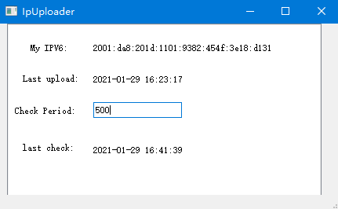
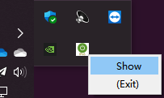

# Ipv6Uploader
A mini program for automatically upload your ipv6 address to remote git repository.

 

Close window and hide in system tray:

## Usage:
1. Fork to your own repository. 
2. Clone to local PC.
3. Run program. Location: `./dist/**starUpLoader/**startUpLoader.exe`
4. ipv6 record: `./ipv6.txt`

## Platform:
To use on other system platform, re-compress the source code into a runnable program using `pyinstaller -w -i pic/code.ico ./src/startUpLoader.py`.    
Download required packages `pip install -r requirements.txt`.
Modify ip qurey command `queryCommand` in upLoader.py accordingly.   

## Setting:
 GUI: 
 * last upload: last time of uploading ipv6.text to remote git repository.
 * Check Period: time frequncy of checking current ipv6.
  
